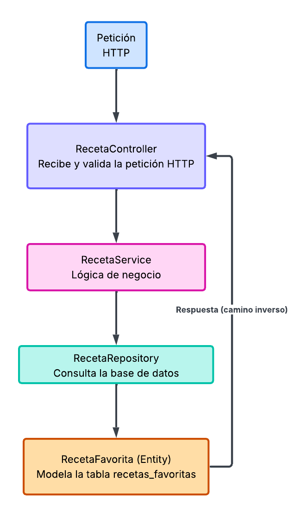

# Actividad Semana 06 — Arquitectura en Capas de una API

**Caso elegido:** Recetas Favoritas (extensión del Buscador de Recetas)

La API permite gestionar las recetas que un usuario guarda como favoritas
(receta, categoría, región), siguiendo la arquitectura en capas:
Controller → Service → Repository → Entity.

## 1. Diagrama de capas

La petición entra por el Controller, baja capa por capa hasta la base de
datos, y la respuesta vuelve por el mismo camino en sentido contrario.

## 2. Responsabilidad de cada capa

| Capa | Clase | Responsabilidad |
|---|---|---|
| Controller | `RecetaController` | Recibe la petición HTTP, valida la entrada (ej. que venga el `mealId`) y devuelve la respuesta en JSON. No accede a la base de datos. |
| Service | `RecetaService` | Contiene la lógica de negocio (ej. evitar guardar una receta duplicada como favorita). |
| Repository | `RecetaRepository` | Lee y escribe en la base de datos (consultas CRUD sobre favoritos). |
| Entity | `RecetaFavorita` | Modela la tabla `recetas_favoritas`: cada instancia es una fila (una receta guardada). |

El Controller nunca habla directo con el Repository; siempre pasa por el Service.

## 3. Endpoint de ejemplo

`POST /api/recetas/favoritas` — guarda una receta como favorita.

1. **Controller** recibe el `mealId` y el nombre de la receta en el body, y llama al Service.
2. **Service** verifica que esa receta no esté ya guardada como favorita (lógica de negocio) y llama al Repository.
3. **Repository** inserta la fila en la tabla `recetas_favoritas`.
4. **Entity** representa la fila creada, que vuelve como respuesta JSON al cliente.

Pasa por las cuatro capas porque cada una tiene una única responsabilidad:
el Controller no sabe insertar en la base de datos, y el Repository no sabe
manejar peticiones HTTP.
