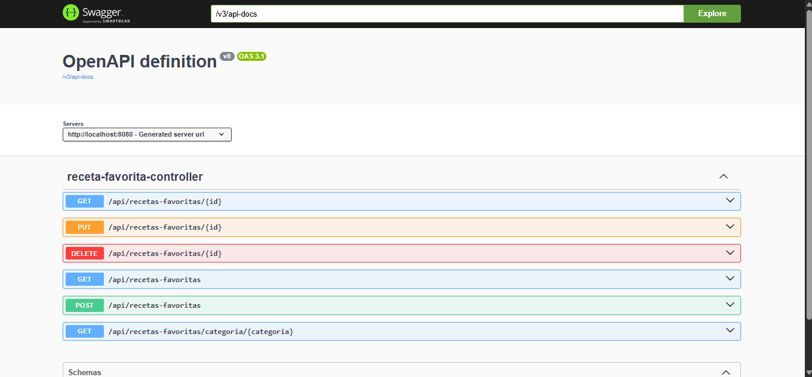
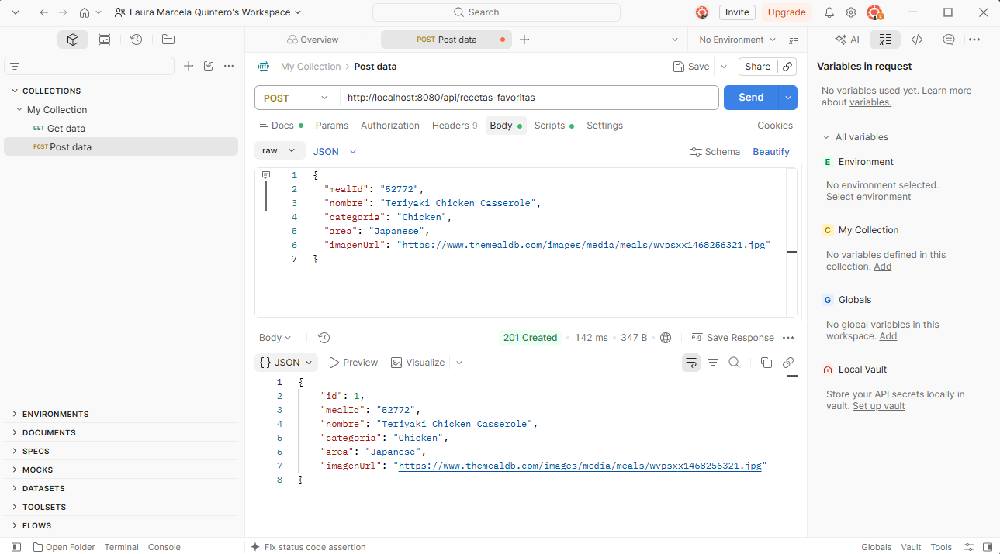
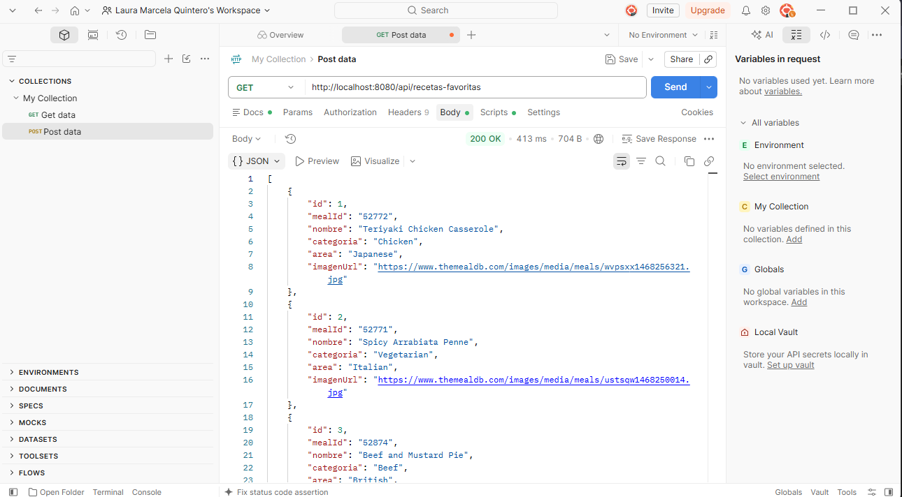
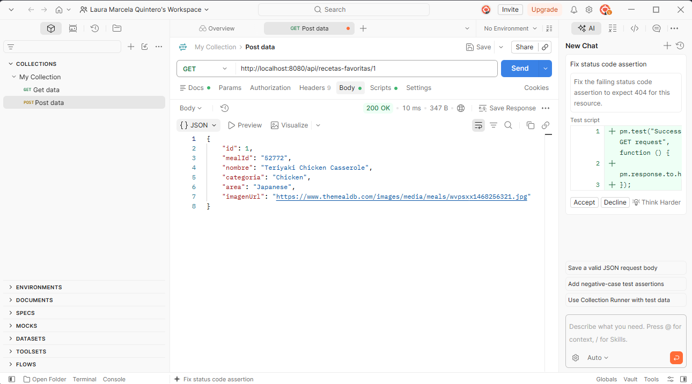
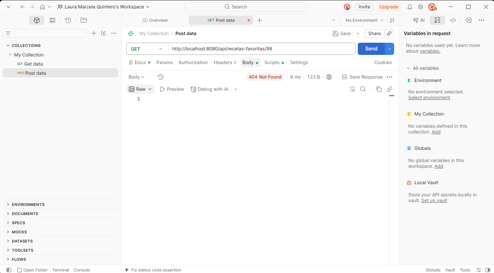
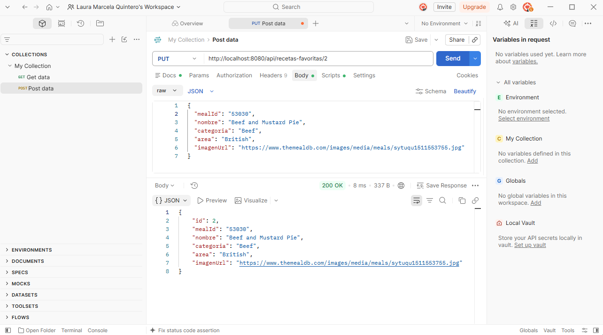
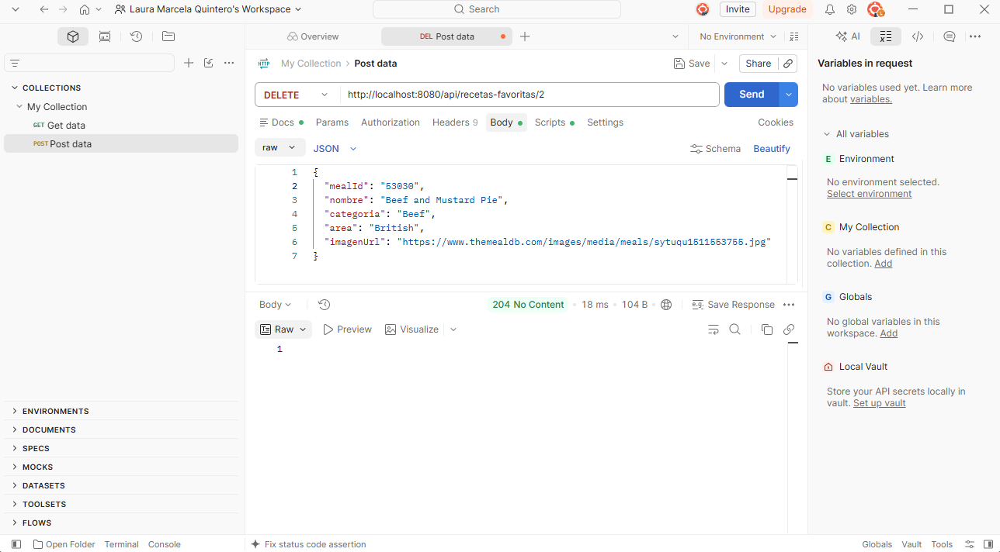
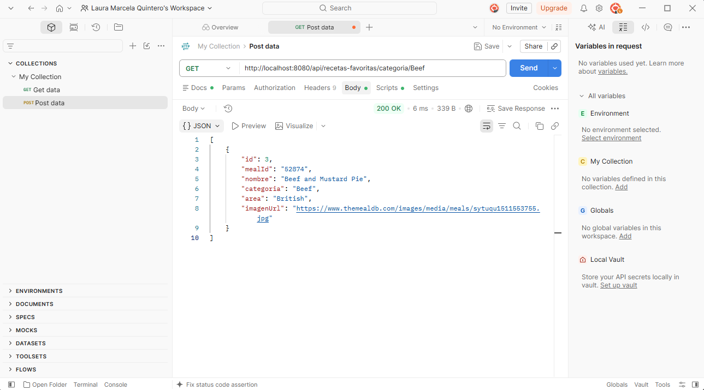

# Actividad calificable · Corte 2 — API REST con Spring Boot (Recetas Favoritas)

Esta es mi entrega de la actividad calificable del Corte 2: una API REST de
Recetas Favoritas con arquitectura en capas, CRUD completo y persistencia con
JPA, documentada con Swagger (OpenAPI) y probada con Postman, incluyendo un
caso de error. La idea es que cualquiera
que vaya a consumir la API, por ejemplo un frontend, sepa qué endpoints hay,
qué reciben y qué devuelven, y que esos endpoints estén comprobados antes de
integrarlos.

El proyecto está hecho con Spring Boot y usa una base de datos H2 en memoria.
El código está organizado por capas (model, repository, service y controller),
con un ajuste respecto a las semanas anteriores: el controller ahora devuelve
`404` de forma explícita cuando se pide un id que no existe (antes devolvía
`null` con `200`, que no es el comportamiento REST correcto).

## 1. Swagger

Para documentar la API agregué la dependencia de springdoc en el `pom.xml`:

```xml
<dependency>
    <groupId>org.springdoc</groupId>
    <artifactId>springdoc-openapi-starter-webmvc-ui</artifactId>
    <version>2.8.9</version>
</dependency>
```

No hace falta escribir más código: al arrancar la aplicación, springdoc lee
el controller y genera la documentación sola. Quedan disponibles dos
direcciones:

- `http://localhost:8080/swagger-ui.html` — página interactiva con todos los
  endpoints, desde la que también se pueden probar.
- `http://localhost:8080/v3/api-docs` — la misma descripción de la API en
  formato JSON (el estándar OpenAPI).

En Swagger UI aparecen los seis endpoints del recurso `/api/recetas-favoritas`
y el esquema de `RecetaFavorita` con sus campos.



## 2. Cómo ejecutarlo

Se necesita Java 17 o superior y Maven. Desde la carpeta
`recetas-favoritas-api`:

```bash
mvn spring-boot:run
```

La API queda en `http://localhost:8080/api/recetas-favoritas` y la
documentación en `http://localhost:8080/swagger-ui.html`.

## 3. Pruebas con Postman

Hice 7 pruebas con Postman, una por captura: crear, listar, obtener, un caso
de error, actualizar, eliminar y filtrar por categoría. Junto con la captura de
Swagger de la sección 1 son 8 evidencias en total.

### 3.1 Crear una receta favorita

`POST http://localhost:8080/api/recetas-favoritas` con este cuerpo en JSON:

```json
{
  "mealId": "52772",
  "nombre": "Teriyaki Chicken Casserole",
  "categoria": "Chicken",
  "area": "Japanese",
  "imagenUrl": "https://www.themealdb.com/images/media/meals/wvpsxx1468256321.jpg"
}
```

Responde `201 Created` y devuelve la receta con el `id` que se le asignó.



### 3.2 Listar las recetas favoritas

`GET http://localhost:8080/api/recetas-favoritas` responde `200 OK` con la
lista de recetas guardadas.



### 3.3 Obtener una receta por id

`GET http://localhost:8080/api/recetas-favoritas/1` responde `200 OK` con los
datos de la receta 1.



### 3.4 Caso de error: receta que no existe

`GET http://localhost:8080/api/recetas-favoritas/99` responde `404 Not Found`
y sin cuerpo, porque no hay ninguna receta con ese id.



### 3.5 Actualizar una receta

`PUT http://localhost:8080/api/recetas-favoritas/2` con el cuerpo de la receta
modificado. Responde `200 OK` y devuelve la receta actualizada.



### 3.6 Eliminar una receta

`DELETE http://localhost:8080/api/recetas-favoritas/2` responde
`204 No Content`: la receta se borró y no hay nada que devolver.



### 3.7 Filtrar por categoría

`GET http://localhost:8080/api/recetas-favoritas/categoria/Beef` responde
`200 OK` con las recetas de esa categoría.



## 4. Códigos de estado obtenidos

| Prueba | Petición | Código obtenido | Qué significa |
|---|---|---|---|
| Crear | `POST /api/recetas-favoritas` | `201 Created` | La petición fue correcta y además se creó un recurso nuevo en el servidor. |
| Listar | `GET /api/recetas-favoritas` | `200 OK` | La petición fue correcta y la respuesta trae lo que se pidió. |
| Obtener una | `GET /api/recetas-favoritas/1` | `200 OK` | La receta existe y se devuelve. |
| Error | `GET /api/recetas-favoritas/99` | `404 Not Found` | La petición está bien formada, pero el recurso que se pide no existe. |
| Actualizar | `PUT /api/recetas-favoritas/2` | `200 OK` | La receta existía y se actualizó. |
| Eliminar | `DELETE /api/recetas-favoritas/2` | `204 No Content` | La receta se eliminó y la respuesta no lleva cuerpo. |
| Filtrar | `GET /api/recetas-favoritas/categoria/Beef` | `200 OK` | Se devuelven las recetas de la categoría pedida. |

Los códigos que empiezan por 2 indican que todo salió bien, y los que
empiezan por 4 indican un error del lado del cliente, es decir, de quien hace
la petición. Por eso crear responde `201` y no un `200` genérico: le dice al
cliente exactamente qué pasó. Y cuando se pide un id que no existe, la API
responde `404` en lugar de un `200` vacío, para que un frontend pueda
distinguir "no encontrado" de "encontrado" y mostrar el mensaje adecuado.

## 5. Estructura del proyecto

```
recetas-favoritas-api/
├── pom.xml
├── README.md
├── evidencias/   (capturas de Swagger UI y Postman)
└── src/main/
    ├── java/com/corhuila/recetasfavoritas/
    │   ├── RecetasFavoritasApplication.java   (arranque)
    │   ├── model/
    │   │   └── RecetaFavorita.java            (entity)
    │   ├── repository/
    │   │   └── RecetaFavoritaRepository.java  (acceso a datos)
    │   ├── service/
    │   │   └── RecetaFavoritaService.java     (lógica)
    │   └── controller/
    │       └── RecetaFavoritaController.java  (endpoints REST)
    └── resources/
        └── application.properties
```

## 6. API reference

This REST API manages a collection of favorite recipes and exposes everything under the base path `/api/recetas-favoritas`. The endpoint `GET /api/recetas-favoritas` returns the full list of saved recipes as a JSON array. The endpoint `GET /api/recetas-favoritas/{id}` returns a single recipe by its id, and it responds with `404 Not Found` when that id does not exist. The endpoint `POST /api/recetas-favoritas` receives a recipe in the JSON body, saves it in the database and returns the created recipe with its generated id. The endpoint `PUT /api/recetas-favoritas/{id}` replaces the data of an existing recipe with the JSON body that is sent. The endpoint `DELETE /api/recetas-favoritas/{id}` removes a recipe and responds with `204 No Content`. Finally, `GET /api/recetas-favoritas/categoria/{categoria}` returns only the recipes that belong to the given category, for example `Beef`. The full interactive documentation is available in Swagger UI at `http://localhost:8080/swagger-ui.html`.

| Method | Endpoint | Description |
|---|---|---|
| GET | `/api/recetas-favoritas` | List all favorite recipes |
| GET | `/api/recetas-favoritas/{id}` | Get one recipe by id (404 if not found) |
| POST | `/api/recetas-favoritas` | Create a new recipe |
| PUT | `/api/recetas-favoritas/{id}` | Update an existing recipe |
| DELETE | `/api/recetas-favoritas/{id}` | Delete a recipe (204 No Content) |
| GET | `/api/recetas-favoritas/categoria/{categoria}` | List recipes filtered by category |
