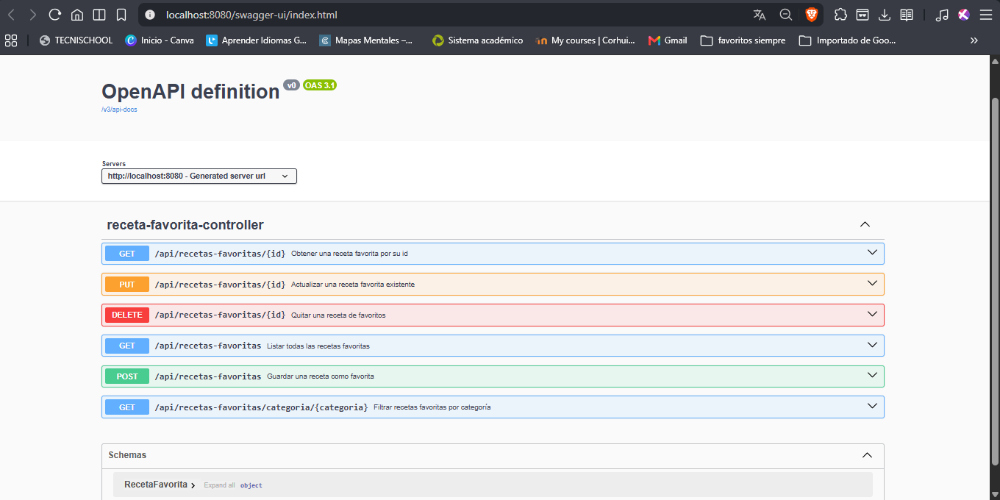
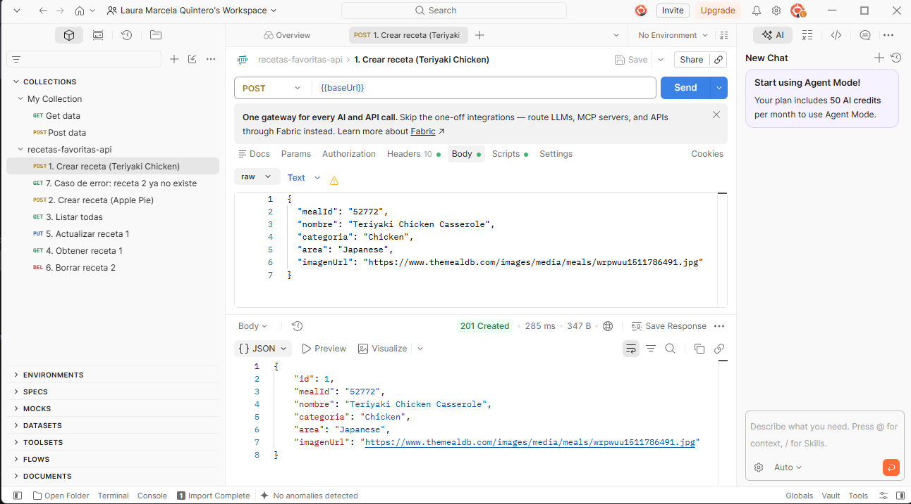
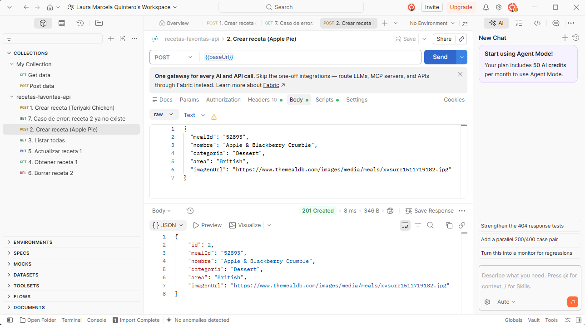
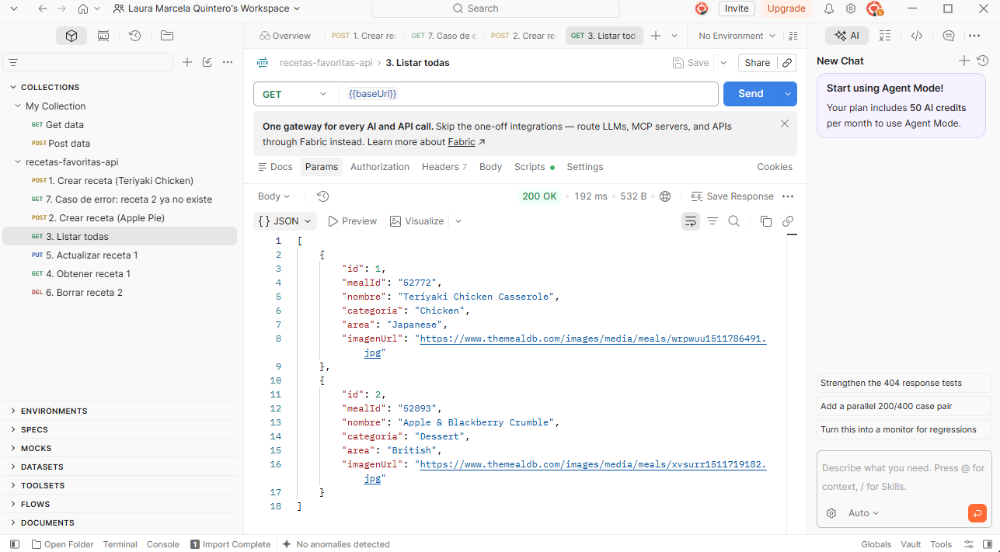
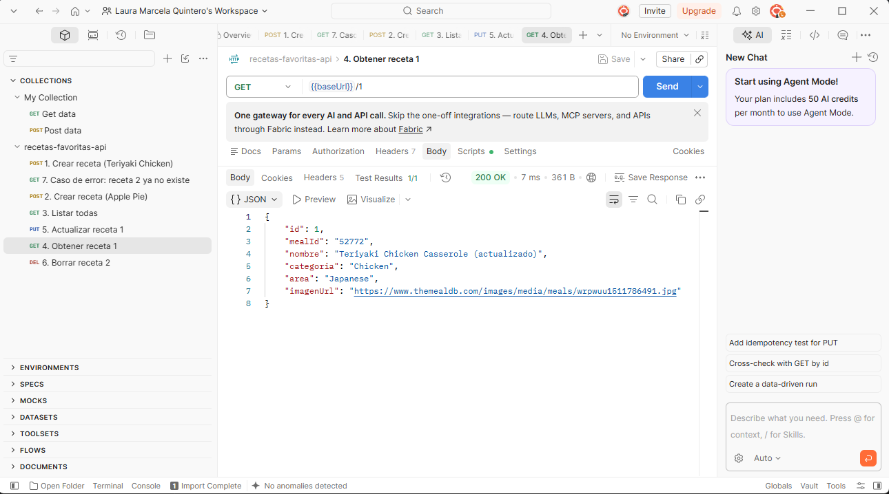
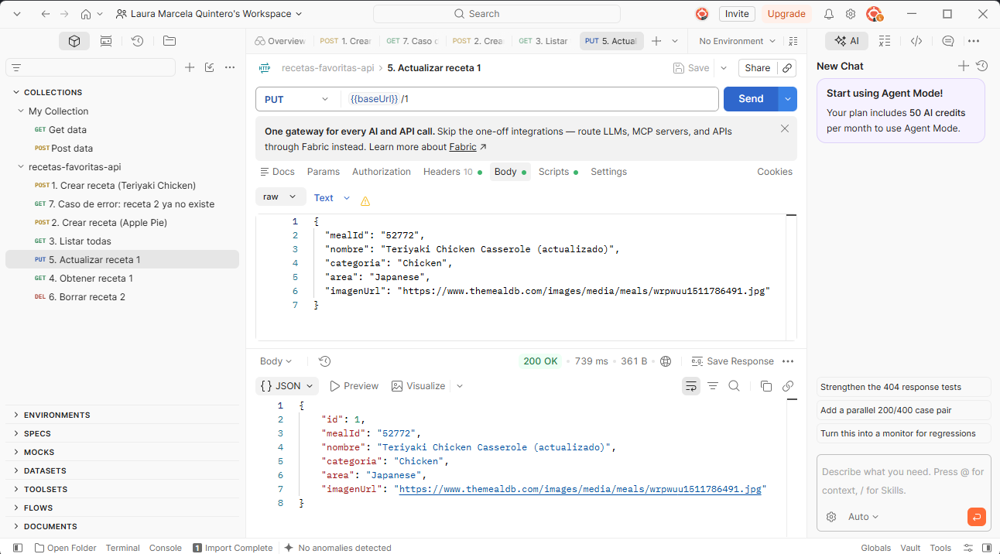
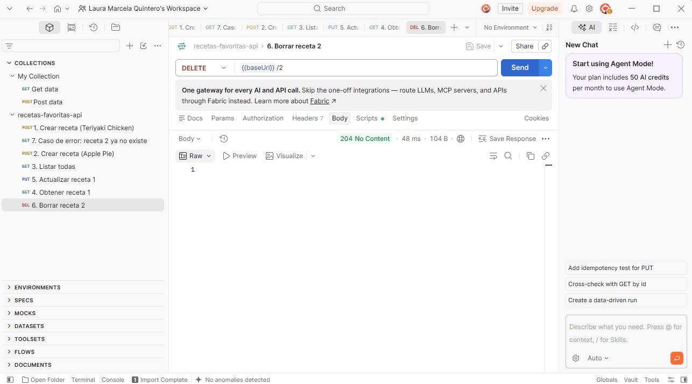
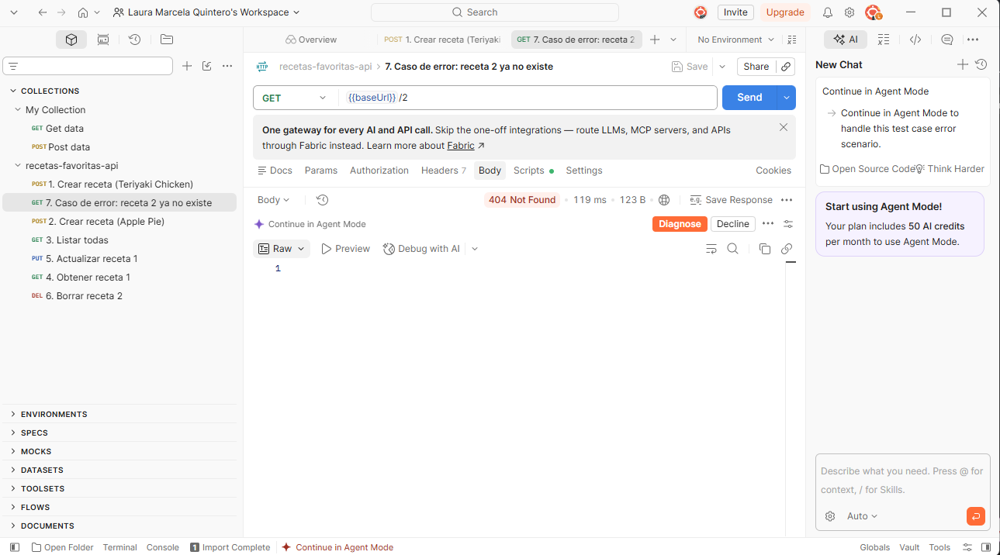

# Semana 10 · API probada — Recetas Favoritas

| | |
|---|---|
| **Estudiante** | Laura Marcela |
| **Materia** | Complementaria III - Profundización Desarrollo Fullstack (2026-B) |
| **Usuario de GitHub** | laura-marcela05 |

Esta semana cerré el backend de Recetas Favoritas. Reuní en un solo proyecto
lo que fui construyendo durante el corte: la arquitectura en capas, la
persistencia con JPA, el CRUD REST y la documentación con Swagger. Después
volví a probar todos los endpoints con Postman, incluyendo un caso de error,
para dejar la API lista para conectarla con un frontend.

El proyecto está hecho con Spring Boot (Java 17, Maven) y usa una base de
datos H2 en memoria.

## 1. Estructura del proyecto

```
10-week/
└── recetas-favoritas-api/
    ├── pom.xml
    ├── evidencias/                                        (capturas de Swagger y Postman)
    ├── postman/
    │   └── recetas-favoritas-api.postman_collection.json   (colección con las pruebas)
    └── src/main/
        ├── java/com/corhuila/recetasfavoritas/
        │   ├── RecetasFavoritasApplication.java            (arranque de la aplicación)
        │   ├── model/RecetaFavorita.java                   (entity)
        │   ├── repository/RecetaFavoritaRepository.java    (repository)
        │   ├── service/RecetaFavoritaService.java          (service)
        │   └── controller/RecetaFavoritaController.java    (controller)
        └── resources/application.properties                (configuración)
```

## 2. Las capas y la persistencia

Una petición entra por el controller, pasa al service, que usa el
repository, y este guarda o consulta la entidad en la base de datos. Cada
capa está en su propio paquete y tiene una sola responsabilidad:

- **Entity (`RecetaFavorita`)**: representa la tabla `receta_favorita`.
  Lleva `@Entity` para que JPA la guarde en la base de datos y `@Id` con
  `@GeneratedValue` para que el id lo asigne la base de datos.
- **Repository (`RecetaFavoritaRepository`)**: es una interfaz que extiende
  `JpaRepository`, así que ya trae los métodos para guardar, listar, buscar
  y borrar sin escribir SQL.
- **Service (`RecetaFavoritaService`)**: tiene la lógica de negocio. Antes
  de actualizar o borrar una receta revisa que exista.
- **Controller (`RecetaFavoritaController`)**: recibe las peticiones HTTP,
  llama al service y responde en JSON con el código de estado que
  corresponde. Nunca accede directamente al repository.

Por ejemplo, la decisión de si una receta se puede borrar la toma el service:

```java
public boolean eliminar(Long id) {
  if (!repo.existsById(id)) {
    return false;
  }
  repo.deleteById(id);
  return true;
}
```

Y el controller solo traduce ese resultado a un código HTTP:

```java
@DeleteMapping("/{id}")
public ResponseEntity<Void> borrar(@PathVariable Long id) {
  if (service.eliminar(id)) {
    return ResponseEntity.noContent().build();
  }
  return ResponseEntity.notFound().build();
}
```

Los datos se guardan con Spring Data JPA en H2. La configuración está en
`application.properties`:

```properties
spring.datasource.url=jdbc:h2:mem:recetasdb
spring.jpa.hibernate.ddl-auto=create-drop
```

Al arrancar, JPA crea la tabla `receta_favorita` a partir de la entity. Como
H2 es en memoria no hay que instalar nada, pero los datos se reinician cada
vez que se detiene la aplicación.

## 3. Cómo ejecutarla

Se necesita Java 17 o superior y Maven. Desde la carpeta
`recetas-favoritas-api`:

```bash
mvn spring-boot:run
```

Con la aplicación arriba quedan disponibles:

- La API: `http://localhost:8080/api/recetas-favoritas`
- Swagger UI: `http://localhost:8080/swagger-ui.html`
- La descripción OpenAPI en JSON: `http://localhost:8080/v3/api-docs`

Para detenerla se presiona `Ctrl + C` en la terminal.

## 4. Endpoints

Todos los endpoints están bajo el recurso `/api/recetas-favoritas`. La URL
usa un sustantivo en plural y la acción la indica el método HTTP.

| Método | URL | Acción | Respuesta |
|---|---|---|---|
| GET | `/api/recetas-favoritas` | Listar todas las recetas favoritas | `200 OK` |
| GET | `/api/recetas-favoritas/{id}` | Obtener una receta | `200 OK` o `404 Not Found` si no existe |
| GET | `/api/recetas-favoritas/categoria/{categoria}` | Filtrar por categoría | `200 OK` |
| POST | `/api/recetas-favoritas` | Crear una receta favorita | `201 Created` |
| PUT | `/api/recetas-favoritas/{id}` | Actualizar una receta | `200 OK` o `404 Not Found` si no existe |
| DELETE | `/api/recetas-favoritas/{id}` | Borrar una receta | `204 No Content` o `404 Not Found` si no existe |

Para crear o actualizar se envía un JSON como este (el `id` no se envía, lo asigna la base de datos):

```json
{
  "mealId": "52772",
  "nombre": "Teriyaki Chicken Casserole",
  "categoria": "Chicken",
  "area": "Japanese",
  "imagenUrl": "https://www.themealdb.com/images/media/meals/wrpwuu1511786491.jpg"
}
```

## 5. Documentación con Swagger

La documentación la genera springdoc, que está como dependencia en el `pom.xml`:

```xml
<dependency>
    <groupId>org.springdoc</groupId>
    <artifactId>springdoc-openapi-starter-webmvc-ui</artifactId>
    <version>2.8.9</version>
</dependency>
```

Al arrancar, springdoc lee el controller y arma la documentación. En cada
endpoint puse además una descripción corta y los códigos de respuesta, para
que Swagger muestre lo mismo que realmente responde la API:

```java
@Operation(summary = "Obtener una receta favorita por su id")
@ApiResponse(responseCode = "200", description = "Receta encontrada")
@ApiResponse(responseCode = "404", description = "No existe una receta con ese id", content = @Content)
@GetMapping("/{id}")
```

En `http://localhost:8080/swagger-ui.html` aparecen los seis endpoints del
recurso y, debajo, el esquema de `RecetaFavorita`.



## 6. Pruebas con Postman

Probé el CRUD completo siguiendo un ciclo de 7 pasos: creé dos recetas, las
listé, consulté una, la actualicé, borré la otra y al final pedí la que
había borrado para comprobar el caso de error. Las peticiones están
guardadas en la colección
`postman/recetas-favoritas-api.postman_collection.json`, que se puede
importar en Postman para repetirlas en el mismo orden.

1. **Crear una receta** — `POST /api/recetas-favoritas` con los datos de Teriyaki Chicken Casserole. Respondió `201 Created` y devolvió la receta con `id: 1`.
   
2. **Crear una segunda receta** — `POST /api/recetas-favoritas` con los datos de Apple & Blackberry Crumble. Respondió `201 Created` con `id: 2`.
   
3. **Listar** — `GET /api/recetas-favoritas` respondió `200 OK` con las dos recetas registradas.
   
4. **Obtener una** — `GET /api/recetas-favoritas/1` respondió `200 OK` con los datos de la receta 1.
   
5. **Actualizar** — `PUT /api/recetas-favoritas/1` cambió el nombre y respondió `200 OK` con los datos actualizados.
   
6. **Borrar** — `DELETE /api/recetas-favoritas/2` respondió `204 No Content`: la receta se borró y la respuesta no trajo cuerpo.
   
7. **Caso de error** — `GET /api/recetas-favoritas/2` respondió `404 Not Found` y sin cuerpo, porque la receta 2 ya no existe. Así se comprobó que el borrado funcionó y que la API avisa con el código correcto cuando se pide un recurso que no está.
   

Los 7 casos se probaron con éxito: `201 Created` al crear, `200 OK` al listar/obtener/actualizar, `204 No Content` al borrar, y `404 Not Found` al pedir un recurso ya eliminado.

Con esto la API queda con su CRUD completo, documentada y probada, lista
para integrarla con el frontend.
